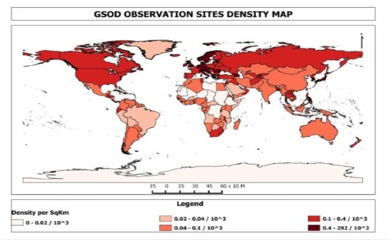

# Portfolio Website

Contains a quick summary about me. The portolio lists out the significant projects I did. This website is made with bootstrap framework
## Projects
Below are the data engineering related projects I did.
### 1. Weather Data Pipeline

**Source Code**: _Ongoing Project_
**Live Dashboard**: _Ongoing Project_

Data Pipeline for [NOAA Global Surface Summary of the Day (GSOD)](https://www.ncei.noaa.gov/access/metadata/landing-page/bin/iso?id=gov.noaa.ncdc:C00516) orchestrated by [Apache Airflow](https://airflow.apache.org/). The aim of the project is to transform an extracted copy of data and load it to BigQuery Data Warehouse.

### 2. r/Art

**Source Code**: _Ongoing Project_
**Live Dashboard**: _Ongoing Project_

The project web-scrapes archived posts in [r/Art](https://www.reddit.com/r/art/) subreddit using the third-party [pushshift](https://pushshift.io/) API. Its purpose is to gather informative data from Reddit art posts to analyze popularity, styles, and community activity.

### 3. Crypto Monitor

**Source Code**: _Ongoing Project_
**Live Dashboard**: _Ongoing Project_

Data pipeline for top 100 cryptocurrency coins data using [Coingecko API](https://www.coingecko.com/en/api/documentation). The data pipeline is made as a function in [Google Cloud Function](https://cloud.google.com/functions) to be executed every 5 minutes through [Google Cloud Scheduler](https://cloud.google.com/scheduler) trigger
